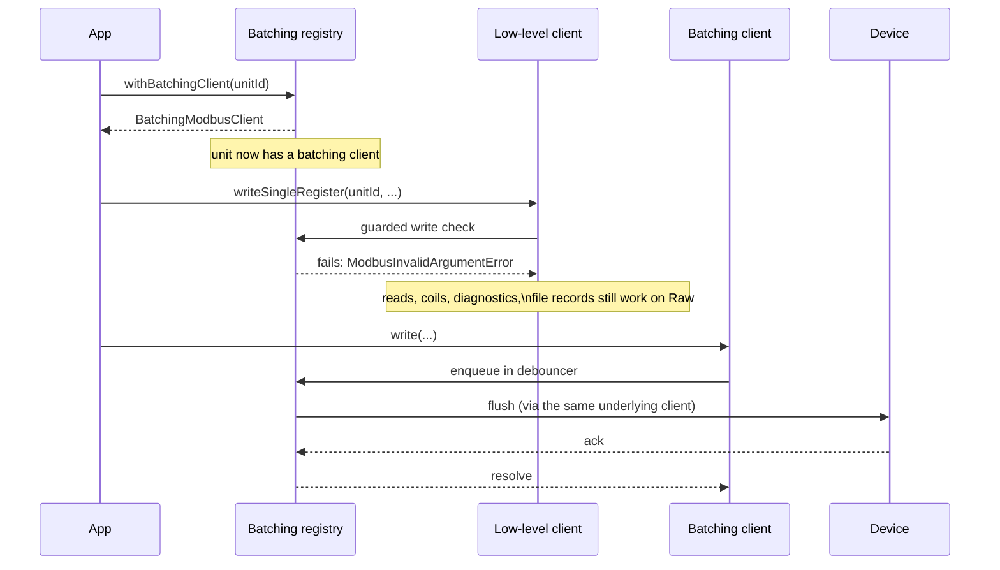
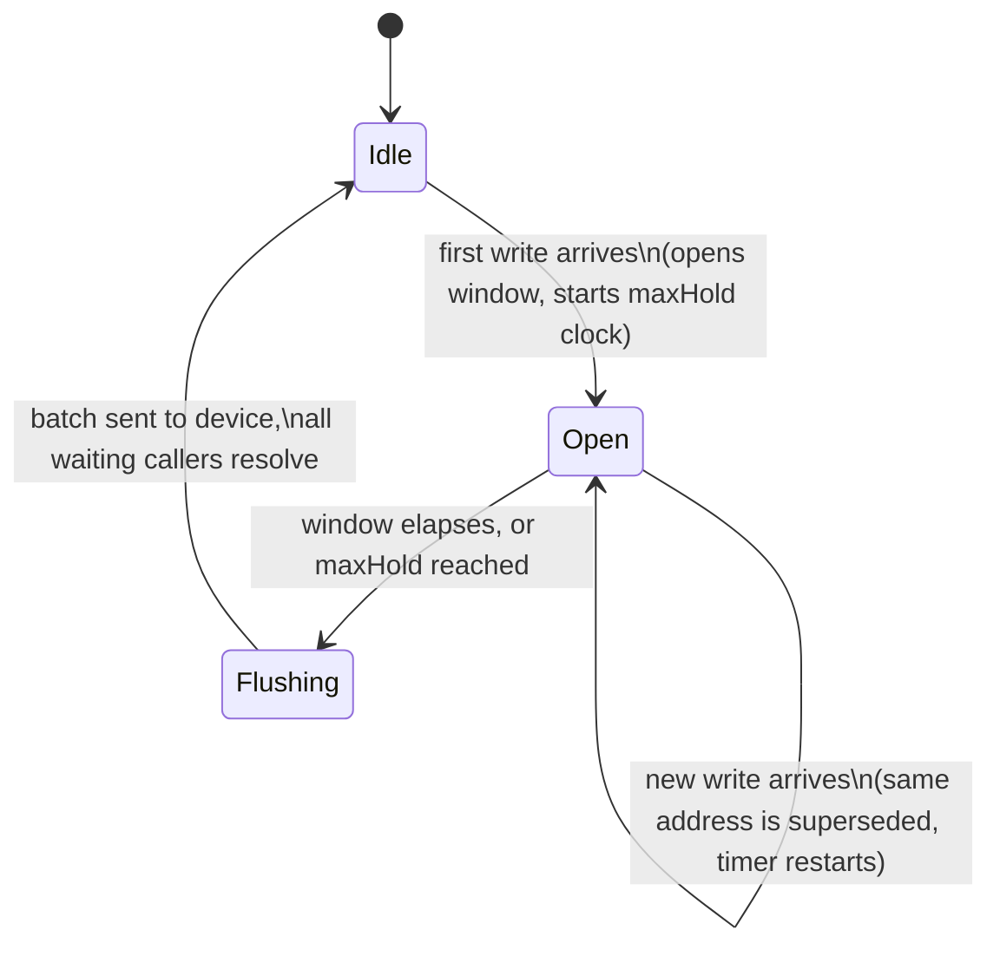
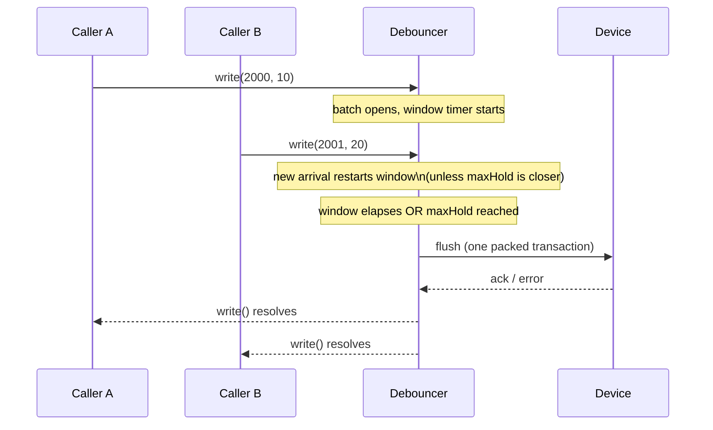

# Effect-modbus-rs

**Type-safe Modbus communication via Effect-TS**, wrapping the [`modbus-rs`](https://github.com/Raghava-Ch/modbus-rs) npm bindings (Rust napi-rs under the hood).

For the complete API reference, see the [GitHub Pages documentation](https://flux-control-solutions.github.io/Effect-modbus-rs/).

Provides scoped [`Context.Service`](https://effect.website) constructors for RTU (serial), TCP, and ASCII Modbus transports. Clients expose a typed `Effect`-based API for all standard Modbus function codes.

> This project is under active development. Its API may change before the 1.0 release.

## Install

```sh
bun add @flux-control/effect-modbus-rs
```

TypeScript only while prototyping (JS consumers will be supported before 1.0).

## Quick start

### RTU (serial)

```ts
import { Console, Effect } from 'effect';
import { RtuTransportService } from '@flux-control/effect-modbus-rs';

const program = Effect.gen(function* () {
  const transport = yield* RtuTransportService;
  const client = yield* transport.withClient(1);

  const registers = yield* client.readHoldingRegisters({
    address: 0,
    quantity: 10,
  });
  console.log('Holding registers:', registers);
});

program.pipe(
  Effect.catchTags({
    ModbusTimeoutError: (err) => Console.log(`Timeout: ${err.message}`),
    ModbusTransportError: (err) => Console.log(`Transport error: ${err.message}`),
    ModbusConnectionClosedError: (err) => Console.log(`Connection lost: ${err.message}`),
    ModbusExceptionError: (err) => Console.log(`Modbus exception ${err.exception}: ${err.message}`),
    ModbusInvalidArgumentError: (err) => Console.log(`Invalid argument: ${err.message}`),
  }),
  Effect.catch((err) => Console.log(`Unhandled error: ${err.message}`)),
  Effect.provide(RtuTransportService.make({ portPath: '/dev/ttyUSB0', baudRate: 9600 })),
  Effect.scoped,
  Effect.runPromise,
);
```

### TCP

```ts
import { Effect } from 'effect';
import { TcpTransportService } from '@flux-control/effect-modbus-rs';

const program = Effect.gen(function* () {
  const transport = yield* TcpTransportService;
  const client = yield* transport.withClient(1);
  const coils = yield* client.readCoils({ address: 0, quantity: 8 });
  console.log('Coils:', coils);
});

program.pipe(
  Effect.provide(TcpTransportService.make({ host: '192.168.1.100', port: 502 })),
  Effect.scoped,
  Effect.runPromise,
);
```

### ASCII

```ts
import { Effect } from 'effect';
import { AsciiTransportService } from '@flux-control/effect-modbus-rs';

const program = Effect.gen(function* () {
  const transport = yield* AsciiTransportService;
  const client = yield* transport.withClient(1);
  const registers = yield* client.readInputRegisters({
    address: 0,
    quantity: 5,
  });
  console.log('Input registers:', registers);
});

program.pipe(
  Effect.provide(AsciiTransportService.make({ portPath: '/dev/ttyUSB0', baudRate: 9600 })),
  Effect.scoped,
  Effect.runPromise,
);
```

### Browser / WASM (`modbus-rs/web`)

`modbus-rs` ships its browser bindings through the `modbus-rs/web` WASM module. This package loads that module dynamically and exposes the same scoped, typed `Effect` client API as its native transports. Since browsers can't open raw TCP or serial connections directly, there are two browser-specific transports:

- **`WasmWsTransportService`** — Modbus TCP over a WebSocket-to-TCP gateway (e.g. the `modbus-gateway` application).
- **`WasmRtuTransportService`** / **`WasmAsciiTransportService`** — Modbus RTU/ASCII over the [Web Serial API](https://developer.mozilla.org/en-US/docs/Web/API/Web_Serial_API), via `WasmSerialTransportService.fromRtu` / `.fromAscii`.

```ts
import { Console, Effect } from 'effect';
import { WasmWsTransportService } from '@flux-control/effect-modbus-rs';

const program = Effect.gen(function* () {
  const transport = yield* WasmWsTransportService;
  const client = yield* transport.withClient(1);
  const registers = yield* client.readHoldingRegisters({ address: 0, quantity: 10 });
  console.log('Holding registers:', registers);
});

program.pipe(
  Effect.provide(WasmWsTransportService.make({ wsUrl: 'ws://localhost:8080' })),
  Effect.scoped,
  Effect.runPromise,
);
```

Web Serial requires a user-granted port handle. **`requestSerialPort()` must be called synchronously from within a user-gesture event handler** (e.g. a button click) — this is a Web Serial API / browser security requirement, not a library restriction:

```ts
import { Effect, Layer } from 'effect';
import { requestSerialPort, WasmRtuTransportService } from '@flux-control/effect-modbus-rs';

connectButton.addEventListener('click', () => {
  Effect.runPromise(
    Effect.gen(function* () {
      const port = yield* requestSerialPort();
      yield* program.pipe(
        Effect.provide(WasmRtuTransportService.make({ port, baudRate: 19200 })),
        Effect.scoped,
      );
    }),
  );
});
```

See `examples/wasm/` for a real, runnable Vite app exercising both transports in an actual browser (`cd examples/wasm && npm install && npm run dev`).

#### Browser server (experimental)

`wasmWsServerLayer` and `wasmSerialRtuServerLayer` / `wasmSerialAsciiServerLayer` wrap `modbus-rs`'s experimental browser server bindings — same `ServerHandlers` callback shape as the native servers below. Two things differ from native:

- Unlike native servers, the WASM server doesn't start serving on bind — these layers fork the required `serve()` loop into the layer's scope automatically, so usage looks the same as the native `tcpServerLayer`.
- For the serial variants, `options.serialPort` comes from your own app's `navigator.serial.requestPort()` call (not from this package's `requestSerialPort()`, which returns a different wrapper type used only by the client transports).

Not demonstrated in `examples/wasm/` (see that app's README) — the same `import { wasmWsServerLayer } from "@flux-control/effect-modbus-rs"` pattern applies.

## Transports

Each transport is a scoped `Context.Service`. You provide it with `Effect.provide`, and the connection is opened on service access and closed when the scope ends.

| Service                               | Options                        | Connection                    |
| ------------------------------------- | ------------------------------ | ----------------------------- |
| `RtuTransportService`                 | `{ portPath, baudRate, ... }`  | `AsyncRtuTransport.open()`    |
| `TcpTransportService`                 | `{ host, port, ... }`          | `AsyncTcpTransport.connect()` |
| `AsciiTransportService`               | `{ portPath, baudRate, ... }`  | `AsyncAsciiTransport.open()`  |
| `WasmWsTransportService` (browser)    | `{ wsUrl, requestTimeoutMs? }` | `WasmWsTransport.connect()`   |
| `WasmRtuTransportService` (browser)   | `{ port, baudRate, ... }`      | `WasmRtuTransport.open()`     |
| `WasmAsciiTransportService` (browser) | `{ port, baudRate, ... }`      | `WasmAsciiTransport.open()`   |

Browser transport option types are re-exported from `modbus-rs/web` unchanged. The native ones are narrowed — `RtuTransportOpenOptions`, `AsciiTransportOpenOptions`, and `TcpTransportOpenOptions` are their `modbus-rs` counterparts minus the retry knobs, for the reasons in [Why the upstream retry knobs are withheld](#why-the-upstream-retry-knobs-are-withheld).

### Abstract serial transport

`SerialTransportService` is a transport-agnostic tag that can be backed by either RTU or ASCII framing — useful when writing code that doesn't need to commit to a specific serial protocol. Provide it with `fromRtu` or `fromAscii`:

```ts
import { Console, Effect } from 'effect';
import { SerialTransportService } from '@flux-control/effect-modbus-rs';

const program = Effect.gen(function* () {
  const transport = yield* SerialTransportService;
  const client = yield* transport.withClient(1);
  const coils = yield* client.readCoils({ address: 0, quantity: 2 });
  console.log('Coils:', coils);
});

// RTU framing
program.pipe(
  Effect.provide(SerialTransportService.fromRtu({ portPath: '/dev/ttyUSB0', baudRate: 9600 })),
  Effect.scoped,
  Effect.runPromise,
);

// Or ASCII framing
// program.pipe(
//   Effect.provide(SerialTransportService.fromAscii({ portPath: "/dev/ttyUSB0", baudRate: 9600 })),
//   Effect.scoped,
//   Effect.runPromise,
// );
```

`WasmSerialTransportService` is the browser equivalent. Provide it with `fromRtu` or `fromAscii`, and give it a port handle from `requestSerialPort`.

Both abstract tags also have `makeMockTransport` for tests. The option set is the same as the option set of the concrete tags. Thus a test that keeps the framing abstract can also set `retry`, `reconnect`, and the mock fault hooks:

```ts
import {
  ModbusTimeoutError,
  RetryPolicies,
  SerialTransportService,
} from '@flux-control/effect-modbus-rs';

let attempts = 0;

const layer = SerialTransportService.makeMockTransport([device])({
  portPath: '/dev/ttyUSB0',
  baudRate: 9600,
  retry: RetryPolicies.serial(),
  // The first two attempts of each operation fail. The policy retries them.
  fault: () =>
    attempts++ < 2
      ? new ModbusTimeoutError({ message: 'no response', cause: new Error('timeout') })
      : undefined,
});
```

See [Testing with mocks](#testing-with-mocks) for the `fault` hook and the `reconnectFault` hook.

## Client API

`transport.withClient(unitId)` returns an `EffectModbusClient` — a typed wrapper around the raw modbus-rs client. All methods return `Effect.Effect<T, ModbusError>`.

### Registers

| Method                                                                                 | Returns    |
| -------------------------------------------------------------------------------------- | ---------- |
| `readHoldingRegisters({ address, quantity })`                                          | `number[]` |
| `readInputRegisters({ address, quantity })`                                            | `number[]` |
| `writeSingleRegister({ address, value })`                                              | `void`     |
| `writeMultipleRegisters({ address, values })`                                          | `void`     |
| `readWriteMultipleRegisters({ readAddress, readQuantity, writeAddress, writeValues })` | `number[]` |

### Coils / discrete inputs

| Method                                      | Returns     |
| ------------------------------------------- | ----------- |
| `readCoils({ address, quantity })`          | `boolean[]` |
| `writeSingleCoil({ address, value })`       | `void`      |
| `writeMultipleCoils({ address, values })`   | `void`      |
| `readDiscreteInputs({ address, quantity })` | `boolean[]` |

### Diagnostics & file access

| Method                                                     | Returns                        |
| ---------------------------------------------------------- | ------------------------------ |
| `readExceptionStatus()`                                    | `number`                       |
| `diagnostics({ subFunction, data })`                       | `DiagnosticsResponse`          |
| `readFifoQueue({ address })`                               | `FifoQueueResponse`            |
| `readFileRecord({ requests })`                             | `number[][]`                   |
| `writeFileRecord({ requests })`                            | `void`                         |
| `readDeviceIdentification({ readDeviceIdCode, objectId })` | `DeviceIdentificationResponse` |

## Transaction batching

`withClient` issues exactly the transaction you name, and stays the right client when you know what the bus should carry. `withBatchingClient` is its sibling for the other case — code with one accessor per register, which knows what it wants to read and write but not what that ought to cost.

```ts
Effect.gen(function* () {
  const client = yield* transport.withClient(3); // exact read
  yield* client.readHoldingRegisters({ address: 2000, quantity: 2 });

  const batched = yield* transport.withBatchingClient(3); // decides the transactions
  yield* batched.writeAll([
    { address: 2000, value: 512 },
    { address: 2001, value: 256 },
  ]); // one FC16
  yield* batched.readAll([0x0000, 0x0001, 0x0002, 0x0020, 0x0021]); // two FC03
});
```

Three things bring the transaction count down, and each is exported on its own:

| Piece                                          | What it does                                                                        |
| ---------------------------------------------- | ----------------------------------------------------------------------------------- |
| `planWrites` / `planReads`                     | Pack neighbouring addresses into the fewest transactions. Pure, no state, no I/O.   |
| `createWriteDebouncer` / `createReadDebouncer` | Collect operations that arrive near each other, so a planner has something to pack. |
| `createRegisterCache`                          | Drop a write whose value the device already holds.                                  |

### Batching client API

| Method                              | Function code | Notes                                                      |
| ----------------------------------- | ------------- | ---------------------------------------------------------- |
| `write({ address, value })`         | FC06 / FC16   | Held for the write window, if one is configured.           |
| `writeNow({ address, value })`      | FC06 / FC16   | Enqueue with supersede, then flush and join. Newest wins.  |
| `writeAll(writes)`                  | FC06 / FC16   | One caller, one group, planned together.                   |
| `writeAllNow(writes)`               | FC06 / FC16   | The same, issued immediately.                              |
| `read(address)`                     | FC03          | Collected for the read window, if one is configured.       |
| `readNow(address)`                  | FC03          | Immediate, and answers every reader already collected.     |
| `readAll(addresses)`                | FC03          | One caller, planned into spans, values in the order asked. |
| `readAllNow(addresses)`             | FC03          | The same, issued immediately.                              |
| `inputs.read` … `inputs.readAllNow` | FC04          | The same four reads over the input registers.              |
| `flush`                             | —             | Issue everything pending, now. Never fails.                |
| `cache`                             | —             | The cache this client filters against, or `undefined`.     |

**A `BatchingModbusClient` is not an `EffectModbusClient`.** It deliberately does not extend `ModbusOperations`: there is no `writeSingleRegister` and no `readHoldingRegisters` on it. For a given unit, choose one holding-register write path for the transport's lifetime. Once a batching client exists, raw FC06, FC16, and FC23 operations for that unit fail with `ModbusInvalidArgumentError`; otherwise they could bypass the pending batch and its cache. A raw client for the same unit remains available for exact reads, coils, file records, diagnostics, and the other non-register-write operations. Coils are not covered by batching because the planners pack registers.

Each unit can have a low-level client, a batching client, or both at once. Once a batching client exists for a unit, the low-level client can still read registers, read/write coils, and use diagnostics — but it can no longer write holding registers directly. A direct write is blocked with a typed error, so it cannot slip past the batch or leave the cache out of date. All holding-register writes for that unit must go through the batching client instead.



### Windows

Nothing is debounced unless you ask for it, the same way nothing retries or reconnects unless you ask:

```ts
Effect.gen(function* () {
  const batched = yield* transport.withBatchingClient(3, {
    debounce: {
      writes: { window: '250 millis', maxHold: '1 second' },
      reads: { window: '5 millis' },
    },
  });
});
```

A write is held for `window`, and each new arrival restarts it. `maxHold` caps the total hold, so a register that updates faster than the window still reaches the wire — without the ceiling, every arrival would postpone the wait forever. It defaults to four times `window`.

A write does not go to the device right away. It waits in the debouncer for the length of `window`. Each new write to the same address resets that wait, so a burst of updates can still land as one transaction. `maxHold` sets a limit on the total wait, so a register that updates fast still reaches the device on time. When the window ends, or `maxHold` is reached, the debouncer sends the batch and tells every waiting caller the result.





A read window does not restart: it opens on the first arrival and expires on time, which a stream of readers cannot push out. A useful size is on the order of one transaction; measure one on your bus before choosing.

`writeAll` and `readAll` plan whatever they are given, so code that already holds a group of registers needs no window at all.

### The cache

The cache records what this process wrote, keyed by unit and address. It is not a read cache and never answers a read. One cache serves every device on a transport, because a cache is a belief about a physical device and two caches on one unit disagree.

It is emptied for a unit after a failed write, and emptied entirely when the link is lost — a device that power-cycles comes back holding something else. An invalidation that lands while a write is still on the wire wins over the observation that follows it, so losing the link cannot be undone by a write that was already in flight. Pass `cache: false` to write every value, or pass your own `RegisterCache` to share one.

Suppressing a write is not always cheaper. Dropping one address out of the middle of a contiguous run splits that run into one FC06 per register, so a cache meant to save turnarounds can spend them instead. Each batch is therefore planned both ways — filtered, and whole — and the plan with fewer transactions wins, with a tie going to the filtered one because its frames are shorter. Keeping a run whole rewrites a register with the value the cache believes it already holds, and never sends more than `cache: false` would have. If you need a register left alone rather than rewritten, use `withClient`: it issues exactly the transaction you name.

The cache and the fiber that watches the link are created on first use, so a transport nobody batches on carries neither.

### Declaring a unit, and reaching for it

Every option a batching client takes is a fact about the unit, not about a caller. One unit holds one batch, one belief about what the device contains, and one window — so two callers can only ever configure a unit correctly by passing identical options. Rather than compare them, the two operations are separate:

```ts
const damper =
  yield * transport.withBatchingClient(3, { debounce: { writes: { window: '50 millis' } } });
const same = yield * transport.batchingClient(3); // elsewhere, no options to restate
```

`withBatchingClient` declares. Declaring a unit twice fails with `ModbusInvalidArgumentError`, whatever the second call asks for. `batchingClient` looks up, and fails the same way when nothing has declared that unit. A lookup that arrives while a declaration is still in flight waits for it, so neither call has to know which one ran first.

### Shutdown

```ts
Effect.gen(function* () {
  const damper = yield* transport.withBatchingClient(3);
  yield* damper.onShutdown(damper.writeAllNow([{ address: 2000, value: 0 }]));

  const motor = yield* transport.withBatchingClient(7);
  yield* motor.onShutdown(motor.writeNow({ address: 40, value: MOTOR_STOP }));
});
```

A safe state is the device's own answer — zero volts for one, a stopped motor for
another — so it is stated on the client that addresses the device. A unit whose
client registers nothing is left alone. The action runs when the calling scope
closes, while the transport is still open, and before the client is torn down.

A failure is logged and raised as a defect. The other actions in the scope still
run, so a device that cannot be reached does not cost the rest of the bus its
turn. Wrap the action in `Effect.ignoreLogged` to accept the failure instead.

`transport.touchedUnits` reports which units a client was built for. That is
transport-wide diagnostic state, not device ownership, and it is not the input to
a shutdown policy.

### Spans

A batching client opens `modbus.write` and `modbus.read` spans, carrying:

| Attribute                  | Content                     |
| -------------------------- | --------------------------- |
| `modbus.unit_ids`          | The units the batch reached |
| `modbus.register_count`    | Registers written or read   |
| `modbus.suppressed_count`  | Writes the cache removed    |
| `modbus.transaction_count` | Transactions issued         |

The write span opens _after_ the cache filter, and only when a write survives it, so it records what reached the bus rather than what was proposed. Only the callers whose values are in the transaction contribute their vocabulary to it — a suppressed caller does not name itself on a frame that did not carry its value. Attach your own vocabulary as a second argument:

```ts
Effect.gen(function* () {
  yield* batched.write({ address: 2000, value: 512 }, { 'app.point': 'Supply fan' });
});
```

Your keys are opaque to this package and are applied first; the `modbus.*` keys are applied last and win a collision, so a caller cannot overwrite the record of what the library wrote. When a batch carries several callers' worth of vocabulary, values for a repeated key are joined with a comma rather than one silently winning.

### Using the layers directly

The batching client is a composition, not a wall. Each layer is exported, and each works without the layer above it.

#### The planners

Pure — no Effect, no state, no I/O. Use them when you own your own scheduling and only want the packing.

```ts
import { planReads, planWrites } from '@flux-control/effect-modbus-rs';

planWrites([
  { address: 2003, value: 40 },
  { address: 2000, value: 10 },
  { address: 2010, value: 99 },
  { address: 2001, value: 20 },
  { address: 2002, value: 30 },
]);
// [
//   { kind: "multiple", address: 2000, values: Uint16Array [10, 20, 30, 40] },
//   { kind: "single",   address: 2010, value: 99 },
// ]

const plan = planReads([0x0000, 0x0001, 0x0002, 0x0020, 0x0021]);
plan.spans; // [{ address: 0, quantity: 3 }, { address: 32, quantity: 2 }]
plan.locate(0x0021); // { span: 1, offset: 1 } — index back into the responses
plan.locate(0x0010); // undefined
```

Each step maps onto exactly one client call: `single` onto `writeSingleRegister`, `multiple` onto `writeMultipleRegisters`. `locate` answers for every address a span covers, so you issue the spans, keep the responses in order, and read each value out without tracking the grouping yourself.

`planWrites(writes, options?)`:

| Option                 | Default                            | What it does                                                                    |
| ---------------------- | ---------------------------------- | ------------------------------------------------------------------------------- |
| `maxRegistersPerWrite` | `MODBUS_MAX_WRITE_REGISTERS` (123) | Registers one FC16 may carry. A longer run splits into consecutive steps.       |
| `minRunLength`         | `2`                                | Shortest run that becomes FC16. Anything shorter becomes one FC06 per register. |

`planReads(addresses, options?)`:

| Option                | Default                           | What it does                                                  |
| --------------------- | --------------------------------- | ------------------------------------------------------------- |
| `maxRegistersPerRead` | `MODBUS_MAX_READ_REGISTERS` (125) | Registers one read may return. A span never grows past this.  |
| `maxGap`              | `0`                               | Unrequested registers the planner may read to join two spans. |

Both constants are the specification's limits, and both are exported. Many devices stop short of them — pass the device's own number when it does.

> **Raising `maxGap` can take healthy registers down with it.** A gap may cover an address the device does not implement. That span then fails with `ILLEGAL_DATA_ADDRESS`, and every address in it fails, including the ones that would have answered. Raise it only against a register map that says the gap is readable.

Both planners throw `RangeError` for an address, a value, or an option that is out of range, since those are programming errors rather than bus conditions. `encodeRegisterValue` is exported for the same reason the planners use it: `-1` and `65535` are the same register contents, so anything comparing a proposed value against a device value has to encode first or it will rewrite the register forever.

#### The debouncers and the cache

Stateful, scoped, and driven by callbacks you supply — use these to batch over a client this package did not hand out.

```ts
Effect.gen(function* () {
  const writes = yield* createWriteDebouncer({
    window: '250 millis',
    maxHold: '1 second',
    flush: (batch) => issueHowever(batch), // yours: cache, plan, span, write
  });

  // Two callers that never meet, one transaction:
  yield* Effect.all(
    [writes.write({ address: 2000, value: 10 }), writes.write({ address: 2001, value: 20 })],
    {
      concurrency: 'unbounded',
    },
  );
});
```

`createWriteDebouncer` takes `window`, an optional `maxHold` (four times `window` by default), and `flush`. It returns `write` / `writeNow` / `writeAll` / `writeAllNow`, a `flush` you can force, and a `pending` count for tests.

`createReadDebouncer` takes `window`, an optional `plan` (the `planReads` options), and `fetch`, which must return one response per span. Its callback owns the function code, so reading input registers rather than holding registers means a second debouncer. It returns `read` / `readNow` / `readAll` / `readAllNow`, plus `flush` and `pending`.

Both take a `Scope` and flush in it rather than in the caller's, so a caller interrupted mid-wait cannot take the pending batch down with it. When that scope closes, callers still waiting are interrupted — their operations never reached the device, and reporting success would break the invariant the `Deferred` exists to hold.

`createRegisterCache` returns `filter(unitId, writes)`, `observe(unitId, address, value)`, and `invalidate(unitId?)`. Call `observe` only after the device acknowledged the write: a value recorded early suppresses the retry that would have fixed it.

#### Composing them yourself

`makeBatchingClient({ unitId, client, cache, debounce, plan })` builds a `BatchingModbusClient` over any `EffectModbusClient`, which is the escape hatch when you are driving an Effect-wrapped client this package did not hand out, or a stub implementing that interface. A raw promise-based `modbus-rs` client is not accepted directly.

`createBatchingRegistry(deps)` is one level below that: it is what `withBatchingClient` and `batchingClient` are made of, including the per-unit declarations and the fiber that watches the link. You need it only if you are writing a transport of your own; both this package's transports and its mock use it. A custom transport must pass each public raw client through `registry.guardRawWrites(unitId, client)` so selecting batching also enforces the one-register-write-path rule.

`mergeSpanAttributes(sources)` is the join rule described under [Spans](#spans), exported so a custom `flush` can apply the same one.

## Error handling

Errors from the underlying Rust layer are mapped to typed `Effect` errors via `Data.TaggedError`:

| Error class                   | Meaning                                               |
| ----------------------------- | ----------------------------------------------------- |
| `ModbusExceptionError`        | Modbus protocol exception (contains `exception` code) |
| `ModbusTimeoutError`          | Request timed out                                     |
| `ModbusTransportError`        | Transport-level failure                               |
| `ModbusInvalidArgumentError`  | Invalid parameters                                    |
| `ModbusConnectionClosedError` | Connection lost                                       |
| `ModbusNotConnectedError`     | Operation attempted before connection                 |
| `ModbusInternalError`         | Unclassified error                                    |

Handle with `Effect.catchTags`. The `ModbusError` union type covers all seven variants.

## Resilience: retries, reconnection, and circuit breaking

> **These are application-level policies, and they are opt-in.**
>
> They are also the _only_ retries in play. The **transport-level** knobs the underlying `modbus-rs` library offers — `retryAttempts`, `retryDelayMs`, and `retryBackoffStrategy` — are **not accepted** by any transport constructor here. Passing one is a type error. See [Why the upstream retry knobs are withheld](#why-the-upstream-retry-knobs-are-withheld).

Resilience belongs to the **transport**, not to call sites. Attach a policy where the transport is created and every client derived from it carries it:

```ts
const layer = TcpTransportService.make({
  host: '192.168.1.50',
  port: 502,
  retry: RetryPolicies.tcp(), // applied to every operation
  reconnect: {}, // supervised reconnect + circuit breaker
});

// call sites never mention retries
Effect.gen(function* () {
  const client = yield* transport.withClient(1);
  yield* client.readHoldingRegisters({ address: 0, quantity: 10 });
});
```

With neither option set, a transport behaves exactly as it always has: one attempt per operation, reconnection only when you ask for it.

### Templates

| Template                     | Shape                                                   | For                                   |
| ---------------------------- | ------------------------------------------------------- | ------------------------------------- |
| `RetryPolicies.none()`       | 1 attempt                                               | Opting out of a wider policy          |
| `RetryPolicies.serial()`     | 3 retries, 50 ms base, ×2, 1 s ceiling                  | RS-232/485 — collisions, noise bursts |
| `RetryPolicies.tcp()`        | 4 retries, 100 ms base, ×2, 5 s ceiling                 | Modbus/TCP — sockets and gateways     |
| `RetryPolicies.persistent()` | 10 retries, 250 ms base, ×2, 30 s ceiling, 5 min budget | Long-running background polling       |

All four jitter their delays — see [Backoff and jitter](#backoff-and-jitter) — and none retry `ModbusInvalidArgumentError` or a deterministic exception code.

Every template is a factory taking overrides, so it doubles as a starting point. Overrides merge into the template rather than replacing it wholesale:

```ts
RetryPolicies.serial({
  maxRetries: 6,
  errors: { ModbusTimeoutError: { baseDelay: '80 millis' } },
});
```

`createRetryPolicy(options)` builds one from scratch with the same options.

### Overriding per client and per operation

One bus often hosts device types that need different logic. A per-client policy **replaces** the transport's, so overrides can never multiply attempt counts:

```ts
Effect.gen(function* () {
  const meter = yield* transport.withClient(1, { retry: RetryPolicies.serial() });
  const plc = yield* transport.withClient(2, { retry: RetryPolicies.serial({ maxRetries: 8 }) });
  const legacy = yield* transport.withClient(3, { retry: RetryPolicies.none() });
});
```

Clients built for the same unit ID under different policies share one underlying connection.

`client.withRetry(policy)` does the same for a single operation:

```ts
Effect.gen(function* () {
  yield* client.withRetry(RetryPolicies.none()).writeSingleCoil({ address: 0, value });
});
```

Resolution order is **per-operation → per-client → transport → none**. First match wins; the others are discarded, not combined.

#### Replacing vs. wrapping

Two things look alike at a call site — both read as "attach a policy here" — but behave differently, and the difference is worth internalising:

| Form                            | Effect on the policy already in force |
| ------------------------------- | ------------------------------------- |
| `withClient(unitId, { retry })` | **Replaces** it                       |
| `client.withRetry(policy)`      | **Replaces** it                       |
| `.pipe(retryModbus(policy))`    | **Wraps** it — the two nest           |

The deciding factor is whether the policy goes _through_ the client or _around_ it. The first two are resolved inside the client when it is built, so the previous policy is never applied. `retryModbus` is a free function piped around an effect the client has **already** wrapped in its own retry — nothing in that path can see the inner policy, so both run and the attempt counts multiply.

Concretely, against a transport policy of `maxRetries: 2` (3 attempts):

```ts
transport.withClient(1, { retry: fast(3) })          // 4 attempts  (replaced)
client.withRetry(fast(4)).readHoldingRegisters(...)  // 5 attempts  (replaced)
client.readHoldingRegisters(...).pipe(retryModbus(fast(3))) // 12 attempts (3 × 4)
```

That last form is only correct over a `RetryPolicies.none()` client — see [Retrying a transaction](#retrying-a-transaction).

### Error-aware by construction

Retrying is only correct for failures that can plausibly resolve themselves, so the policy decides per error:

| Error                         | Retried by default                                                 |
| ----------------------------- | ------------------------------------------------------------------ |
| `ModbusTimeoutError`          | yes — slow turnaround, bus contention                              |
| `ModbusTransportError`        | yes — framing/CRC corruption                                       |
| `ModbusConnectionClosedError` | yes — and hands the link to the supervisor                         |
| `ModbusCircuitOpenError`      | yes — refused without touching the bus, so it is cheap to wait out |
| `ModbusExceptionError`        | only for codes `5`, `6`, `10`, `11` (busy / gateway)               |
| `ModbusInvalidArgumentError`  | no — the answer will not change                                    |
| `ModbusNotConnectedError`     | no                                                                 |
| `ModbusInternalError`         | no                                                                 |

Any of these can be switched off (`errors: { ModbusTimeoutError: false }`), switched on, or given their own backoff curve (`errors: { ModbusConnectionClosedError: { baseDelay: '250 millis' } }`). The retry budget is shared across categories — only the delay curve is per-error — so a mixed failure sequence still stops after `maxRetries`.

### Backoff and jitter

Delays follow `min(maxDelay, baseDelay × factor ** retryIndex)`, then get jittered.

**Jitter is on by default** — for `createRetryPolicy()` and for every template, none of which opts out. Each delay is multiplied by a random factor so a fleet of pollers does not re-hit a recovering device in lockstep:

| `jitter`                     | Delay                                                    |
| ---------------------------- | -------------------------------------------------------- |
| omitted, or `true` (default) | ±20% — Effect's `0.8 – 1.2` multiplier range             |
| `false`                      | exact, unrandomised delays — useful for assertable tests |
| `{ min: 0.5, max: 1.5 }`     | custom multiplier range                                  |

So `RetryPolicies.tcp()` waits roughly 80–120 ms before its first retry, not exactly 100 ms.

### Supervised reconnection and the circuit breaker

Passing `reconnect` hands reconnection to a supervisor fiber owned by the transport — **one reconnect for the whole application**, however many fibers were in flight when the link dropped:

```ts
TcpTransportService.make({
  host,
  port,
  reconnect: {
    policy: RetryPolicies.tcp(), // how reconnect attempts are spaced
    resetAfter: '30 seconds', // how long the circuit stays open before probing
    triggerOn: ['ModbusConnectionClosedError', 'ModbusTransportError'],
  },
});
```

While the link is being re-established, operations are refused with `ModbusCircuitOpenError` instead of queueing requests onto a dead bus. Because that error is retryable by default and costs nothing on the wire, a polling loop with a generous policy simply rides out the outage; one with a short budget fails fast and lets the caller decide.

Without `reconnect`, a connection-level failure still publishes `Down`, but no
supervisor starts and no circuit breaker is enabled. Call `transport.reconnect()`
to recover manually. A later successful operation also restores `Connected`, so
a transient failure recovered by an operation retry does not leave stale state.

State transitions are published on `transport.connectionState`:

| State          | Meaning                                                                                       |
| -------------- | --------------------------------------------------------------------------------------------- |
| `Disconnected` | Never opened, or closed. The next operation opens it lazily.                                  |
| `Connected`    | Usable.                                                                                       |
| `Reconnecting` | Supervisor is re-establishing the link. Operations refused.                                   |
| `Down`         | Link failure observed. A configured supervisor waits to probe; manual mode remains unguarded. |

```ts
Effect.gen(function* () {
  yield* Stream.runForEach(SubscriptionRef.changes(transport.connectionState), (state) =>
    Console.log(`link: ${state._tag}`),
  );
});
```

### Retrying a transaction

`retryModbus(policy)` remains exported for the one case the transport cannot express: driving a **compound** operation as a unit, where retrying individual frames would be wrong.

```ts
Effect.gen(function* () {
  const client = yield* transport.withClient(1, { retry: RetryPolicies.none() });

  yield* Effect.gen(function* () {
    const current = yield* client.readHoldingRegisters({ address: 0, quantity: 2 });
    yield* client.writeMultipleRegisters({ address: 0, values: bump(current) });
  }).pipe(retryModbus(RetryPolicies.tcp()));
});
```

Take a `RetryPolicies.none()` client first. Unlike `withClient({ retry })` and `client.withRetry()`, which replace the policy in force, `retryModbus` wraps whatever the client is already doing — so over a policied client the two nest and the attempt counts multiply. See [Replacing vs. wrapping](#replacing-vs-wrapping).

See `examples/retry-policies.ts` for a runnable walkthrough.

### Why the upstream retry knobs are withheld

`modbus-rs` exposes `retryAttempts`, `retryDelayMs`, and `retryBackoffStrategy` on its transport options. This package removes all three from every transport constructor, so setting one is a compile error rather than a documented hazard:

```ts
TcpTransportService.make({ host, port, retryAttempts: 3 });
//                                        ^^^^^^^^^^^^^ Object literal may only specify
//                                        known properties, and 'retryAttempts' does not
//                                        exist in type 'TcpTransportOpenOptions & …'
```

They are withheld rather than merely discouraged because enabling them is never the right call under this design:

- **They retry below the Effect boundary.** A failure they paper over never reaches your policy, the circuit breaker, or your logs. The caller sees one slow success instead of several failures and a recovery, and any caller-side `Effect.timeout` is measuring inflated time.
- **They reconnect.** Upstream re-establishes the link inline and replays in-flight requests after it, which races the single supervisor fiber that is supposed to own reconnection for the whole transport.
- **They multiply.** Neither layer knows about the other, so attempt counts compound and the two backoff curves interleave.
- **`retryDelayMs` is flat and unjittered** — exactly the lockstep-collision pattern `RetryPolicies.serial()` exists to break up on a shared RS-485 segment.
- **`retryBackoffStrategy` does nothing.** It is documented upstream as inert and reserved for future implementation, so `'exponential'` silently gets you a flat delay.

Use `retry` and `reconnect` on the transport instead. If you genuinely need frame-level resends, construct a raw `modbus-rs` client directly, where that trade-off is explicit rather than hidden under an Effect service.

The narrowed option types are exported as `RtuTransportOpenOptions`, `AsciiTransportOpenOptions`, and `TcpTransportOpenOptions`, alongside the generic `WithoutUpstreamRetry<T>` and the `UpstreamRetryOptionKey` union.

## Testing with mocks

Each transport service provides a `makeMockTransport(devices)` static method that returns an in-memory mock `Layer` — no serial port or network required.

```ts
import { Console, Effect } from 'effect';
import { RtuTransportService } from '@flux-control/effect-modbus-rs';

const device = {
  unitId: 1,
  coils: [
    { address: 0, default: true },
    { address: 1, default: false },
  ],
  discreteInputs: [],
  holdingRegisters: [
    { address: 0, default: 100 },
    { address: 1, default: 200 },
  ],
  inputRegisters: [],
};

const program = Effect.gen(function* () {
  const transport = yield* RtuTransportService;
  const client = yield* transport.withClient(1);
  const coils = yield* client.readCoils({ address: 0, quantity: 2 });
  console.log('Coils:', coils);
});

const mockLayer = RtuTransportService.makeMockTransport([device])({
  portPath: '/dev/ttyUSB0',
  baudRate: 9600,
});

program.pipe(Effect.provide(mockLayer), Effect.scoped, Effect.runPromise);
```

The mock factory is the same for every transport. Each tag has a static `makeMockTransport` method, and each accepts the same options: the open options of that transport, the resilience options (`retry` and `reconnect`), and the two fault hooks below. To change transport, use a different tag and adjust the shape of the open options.

See `examples/rtu-mock.ts`, `examples/tcp-mock.ts`, and `examples/ascii-mock.ts` for full walkthroughs covering read, write, multi-device access, and error-case testing.

### Fault injection

Two mock-only hooks make a policy testable without hardware:

| Hook             | When it runs                   | Return value                                                                 |
| ---------------- | ------------------------------ | ---------------------------------------------------------------------------- |
| `fault`          | Before every operation attempt | A `ModbusError` fails that attempt. `undefined` lets it through.             |
| `reconnectFault` | Before every reconnect attempt | A `ModbusError` keeps the link down. `undefined` lets the reconnect succeed. |

Because `fault` runs before each _attempt_, an error from it is the same as a device that refused that attempt. A retry policy, the backoff, and the circuit breaker therefore behave as they do on a real bus:

```ts
import {
  ModbusTimeoutError,
  RetryPolicies,
  RtuTransportService,
} from '@flux-control/effect-modbus-rs';

let attempts = 0;

const mockLayer = RtuTransportService.makeMockTransport([device])({
  portPath: '/dev/ttyUSB0',
  baudRate: 9600,
  retry: RetryPolicies.serial(),
  fault: () =>
    attempts++ < 2
      ? new ModbusTimeoutError({ message: 'no response', cause: new Error('timeout') })
      : undefined,
});
```

### Slave device schema

| Property           | Type                     | Default  |
| ------------------ | ------------------------ | -------- |
| `unitId`           | `number`                 | required |
| `coils`            | `{ address, default }[]` | `[]`     |
| `discreteInputs`   | `{ address, default }[]` | `[]`     |
| `holdingRegisters` | `{ address, default }[]` | `[]`     |
| `inputRegisters`   | `{ address, default }[]` | `[]`     |

Coil/default values default to `false` if omitted at the address level; register values default to `0`. Reads beyond the highest configured address produce a `ModbusInvalidArgumentError`.

## Development

| Action      | Command                      |
| ----------- | ---------------------------- |
| Install     | `bun install`                |
| Type-check  | `bun run typecheck`          |
| Test        | `bun test`                   |
| Run example | `bun run examples/<name>.ts` |

No build step — `noEmit` is on; Bun runs `.ts` directly.

## Source layout

```
src/
  errors.ts                  — Data.TaggedError types + toModbusError converter
  modbus-client.ts           — EffectModbusClient interface + factory (native + WASM)
  mocks.ts                   — Schema-validated mock transport + slave device definitions
  connection.ts              — Connection state machine, reconnect supervisor, circuit breaker
  retry.ts                   — Opt-in retry policies (backoff, jitter, per-error rules)
  shared-transport.ts        — Generic scoped transport lifecycle management, WithoutUpstreamRetry
  register-plan.ts           — planWrites / planReads: pure transaction packing
  register-cache.ts          — createRegisterCache: what each device already holds
  write-debouncer.ts         — createWriteDebouncer: coalesces writes that arrive separately
  read-debouncer.ts          — createReadDebouncer: collects reads that arrive separately
  batching-client.ts         — the batching client and the per-transport registry
  span-attributes.ts         — ModbusSpanAttributes and the merge rule for a batch
  RtuTransportService.ts     — Scoped Context.Service wrapping AsyncRtuTransport
  TcpTransportService.ts     — Scoped Context.Service wrapping AsyncTcpTransport
  AsciiTransportService.ts   — Scoped Context.Service wrapping AsyncAsciiTransport
  SerialTransportService.ts  — Abstract serial transport (RTU/ASCII) tag
  TcpModbusServerService.ts  — tcpServerLayer
  SerialModbusServerService.ts — serialRtuServerLayer / serialAsciiServerLayer
  TcpGatewayService.ts       — tcpGatewayLayer
  WasmSerialPort.ts          — requestSerialPort() Effect helper (browser, user-gesture gated)
  WasmWsTransportService.ts  — Scoped Context.Service wrapping WasmWsTransport (browser, WS gateway)
  WasmRtuTransportService.ts — Scoped Context.Service wrapping WasmRtuTransport (browser, Web Serial RTU)
  WasmAsciiTransportService.ts — Scoped Context.Service wrapping WasmAsciiTransport (browser, Web Serial ASCII)
  WasmSerialTransportService.ts — Abstract browser serial transport (RTU/ASCII) tag
  WasmTcpServerService.ts    — wasmWsServerLayer (experimental)
  WasmSerialModbusServerService.ts — wasmSerialRtuServerLayer / wasmSerialAsciiServerLayer (experimental)
examples/
  rtu-basic.ts               — RTU usage pattern
  tcp-basic.ts               — TCP usage pattern
  ascii-basic.ts             — ASCII usage pattern
  serial-abstract.ts         — Abstract serial transport (RTU or ASCII)
  rtu-mock.ts                — RTU with in-memory mock
  tcp-mock.ts                — TCP with in-memory mock (multi-device)
  ascii-mock.ts              — ASCII with in-memory mock (error-case)
  retry-policies.ts          — Transport-owned resilience: policies, overrides, transactions
  batching.ts                — Transaction batching: planners, cache, windows, spans
  tcp-polling-stream.ts      — TCP polling, reconnect, and stream
  tcp-finalizer-reset.ts     — TCP scope finalizer reset demo
  tcp-server.ts              — TCP server example
  serial-server.ts           — Serial RTU server example
  wasm/                      — Standalone runnable Vite app for the browser transports (own README, own npm project)
index.ts                     — Re-exports public API
```

## License

GPL-3.0
