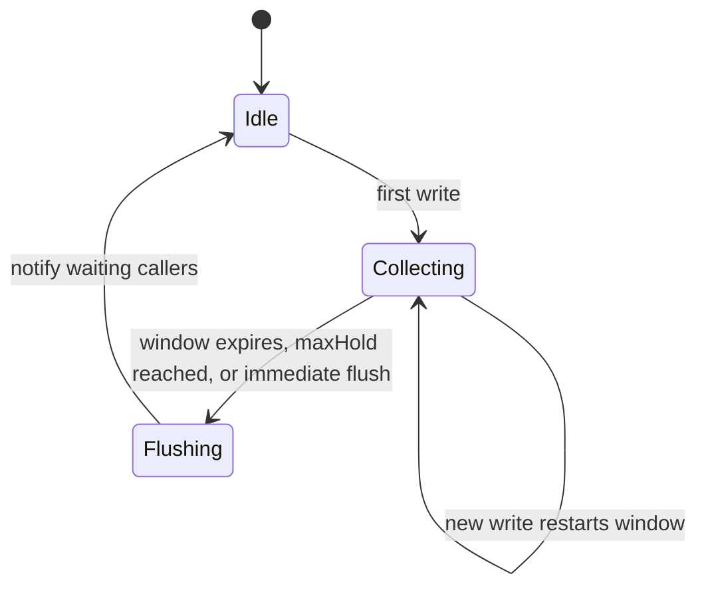

# Effect-modbus-rs

Typed Effect 4 services for Modbus communication through the
[`modbus-rs`](https://github.com/Raghava-Ch/modbus-rs) Rust bindings.

The package provides native TCP, RTU, and ASCII transports.
Browser transports use WebSocket or Web Serial through `modbus-rs/web`.
Each transport owns its connection, clients, and optional batching state within a scope.

For the API reference, see the [GitHub Pages documentation](https://flux-control-solutions.github.io/Effect-modbus-rs/).
The API can change before version 1.0.

## Install

```sh
bun add @flux-control/effect-modbus-rs effect@4.0.0-rc.118
```

The current package requires Effect `^4.0.0-rc.118` as a peer dependency.
It depends on `modbus-rs@0.16.2`.
The published package exports JavaScript and TypeScript declarations from `dist/`.

## Quick start

```ts
import { Console, Effect } from 'effect';
import { TcpTransportService } from '@flux-control/effect-modbus-rs';

const program = Effect.gen(function* () {
  const transport = yield* TcpTransportService;
  const client = yield* transport.withClient(1);
  const registers = yield* client.readHoldingRegisters({ address: 0, quantity: 2 });
  yield* Console.log(registers);
});

program.pipe(
  Effect.provide(TcpTransportService.make({ host: '192.0.2.1', port: 502 })),
  Effect.scoped,
  Effect.runPromise,
);
```

The transport opens on the first client request, not when the service tag is read.
It caches raw clients by unit ID and closes the connection when its scope ends.
All clients from one transport share the same connection.

## Transports

| Service                     | Connection options                      | Binding               |
| --------------------------- | --------------------------------------- | --------------------- |
| `TcpTransportService`       | `host`, `port`                          | `AsyncTcpTransport`   |
| `RtuTransportService`       | `portPath`, `baudRate`, serial settings | `AsyncRtuTransport`   |
| `AsciiTransportService`     | `portPath`, `baudRate`, serial settings | `AsyncAsciiTransport` |
| `WasmWsTransportService`    | `wsUrl`, optional request timeout       | `WasmWsTransport`     |
| `WasmRtuTransportService`   | `port`, `baudRate`, serial settings     | `WasmRtuTransport`    |
| `WasmAsciiTransportService` | `port`, `baudRate`, serial settings     | `WasmAsciiTransport`  |

Concrete services expose `make(options)` layer factories and `makeScoped(options)` constructor effects.
Bindings load dynamically when a live connection is requested.
Browser initialization does not need to load native transports.

### Serial transports

For native serial connections, provide `RtuTransportService.make` or `AsciiTransportService.make` with a port path and baud rate.
`SerialTransportService` provides one service tag for either framing format.
Its `fromRtu(options)` and `fromAscii(options)` methods provide that tag.

```ts
import { Console, Effect } from 'effect';
import { SerialTransportService } from '@flux-control/effect-modbus-rs';

const program = Effect.gen(function* () {
  const transport = yield* SerialTransportService;
  const client = yield* transport.withClient(1);
  yield* Console.log(yield* client.readCoils({ address: 0, quantity: 2 }));
});

program.pipe(
  Effect.provide(SerialTransportService.fromRtu({ portPath: '/dev/ttyUSB0', baudRate: 9600 })),
  Effect.scoped,
  Effect.runPromise,
);
```

### Browser transports

`WasmWsTransportService.make({ wsUrl })` connects to a WebSocket-to-TCP gateway.
A browser cannot open a raw Modbus TCP socket.
The gateway must connect to the target Modbus device.

Web Serial client transports require a `WasmSerialPortHandle` from `requestSerialPort()`.
Run the request effect from a user-gesture handler, such as a button click.
The helper imports the browser binding asynchronously before it requests the port.
It does not call the browser permission API synchronously in the handler.
Permission behavior depends on browser support and transient user activation.

```ts
import { Console, Effect } from 'effect';
import { requestSerialPort, WasmRtuTransportService } from '@flux-control/effect-modbus-rs';

const connectButton = document.querySelector<HTMLButtonElement>('#connect');

connectButton?.addEventListener('click', () => {
  void Effect.runPromise(
    Effect.gen(function* () {
      const port = yield* requestSerialPort();
      yield* Effect.gen(function* () {
        const transport = yield* WasmRtuTransportService;
        const client = yield* transport.withClient(1);
        yield* Console.log(yield* client.readHoldingRegisters({ address: 0, quantity: 2 }));
      }).pipe(
        Effect.provide(WasmRtuTransportService.make({ port, baudRate: 19200 })),
        Effect.scoped,
      );
    }),
  );
});
```

`WasmSerialTransportService.fromRtu` and `.fromAscii` provide the abstract browser serial tag.
Both accept a port handle obtained through the same helper.
See [the browser example](examples/wasm/README.md) for setup and browser requirements.

## Raw client API

`transport.withClient(unitId, options?)` returns an `EffectModbusClient`.
Each operation returns an `Effect` with typed `ModbusError` failures.
Addresses are zero-based protocol addresses.
Support for a function code depends on the device and binding.

| Method                                                                                 | Function code | Success value                  |
| -------------------------------------------------------------------------------------- | ------------- | ------------------------------ |
| `readHoldingRegisters({ address, quantity })`                                          | FC03          | `Uint16Array`                  |
| `readInputRegisters({ address, quantity })`                                            | FC04          | `Uint16Array`                  |
| `writeSingleRegister({ address, value })`                                              | FC06          | `void`                         |
| `writeMultipleRegisters({ address, values })`                                          | FC16          | `void`                         |
| `readWriteMultipleRegisters({ readAddress, readQuantity, writeAddress, writeValues })` | FC23          | `Uint16Array`                  |
| `readCoils({ address, quantity })`                                                     | FC01          | `CoilState[]`                  |
| `readDiscreteInputs({ address, quantity })`                                            | FC02          | `CoilState[]`                  |
| `writeSingleCoil({ address, value })`                                                  | FC05          | `void`                         |
| `writeMultipleCoils({ address, values })`                                              | FC15          | `void`                         |
| `readExceptionStatus()`                                                                | FC07          | `number`                       |
| `diagnostics({ subFunction, data })`                                                   | FC08          | `DiagnosticsResponse`          |
| `readFileRecord({ requests })`                                                         | FC20          | `Uint16Array[]`                |
| `writeFileRecord({ requests })`                                                        | FC21          | `void`                         |
| `readFifoQueue({ address })`                                                           | FC24          | `FifoQueueResponse`            |
| `readDeviceIdentification({ readDeviceIdCode, objectId })`                             | FC43 / MEI 14 | `DeviceIdentificationResponse` |

Coil operations use `CoilState.On` and `CoilState.Off` from `modbus-rs`, rather than boolean values.
FC23 performs its write and read within one Modbus request.
It does not make separate application operations atomic.

## Transaction batching

Use `withClient` when the caller selects exact Modbus transactions.
Use `withBatchingClient` to collect register operations, plan contiguous transactions, and suppress redundant writes.
Batching does not cover coils, diagnostics, or file records.

```ts
import { Console, Effect } from 'effect';
import { TcpTransportService } from '@flux-control/effect-modbus-rs';

const program = Effect.gen(function* () {
  const transport = yield* TcpTransportService;
  const client = yield* transport.withBatchingClient(3, {
    debounce: {
      writes: { window: '250 millis', maxHold: '1 second' },
      reads: { window: '5 millis' },
    },
  });

  yield* client.writeAllNow([
    { address: 2000, value: 512 },
    { address: 2001, value: 256 },
  ]);
  yield* Console.log(yield* client.readAllNow([0, 1, 2, 32, 33]));
  yield* client.onShutdown(client.writeAllNow([{ address: 2000, value: 0 }]));
});

program.pipe(
  Effect.provide(TcpTransportService.make({ host: '192.0.2.1', port: 502 })),
  Effect.scoped,
  Effect.runPromise,
);
```

### Batching client methods

| Method                                    | Behavior                                                         |
| ----------------------------------------- | ---------------------------------------------------------------- |
| `write(write, attributes?)`               | Collect one holding-register write for the configured window.    |
| `writeNow(write, attributes?)`            | Enqueue one write and flush pending writes immediately.          |
| `writeAll(writes, attributes?)`           | Collect a group as one caller for the configured window.         |
| `writeAllNow(writes, attributes?)`        | Enqueue a group and flush pending writes immediately.            |
| `read(address)`                           | Collect one holding-register read.                               |
| `readNow(address)`                        | Enqueue one address and flush collected reads immediately.       |
| `readAll(addresses)`                      | Collect a group and return values in the requested order.        |
| `readAllNow(addresses)`                   | Enqueue a group and flush collected reads immediately.           |
| `inputs.read` through `inputs.readAllNow` | Apply the same read methods to input registers.                  |
| `flush`                                   | Flush writes, holding-register reads, then input-register reads. |
| `onShutdown(action)`                      | Register an action in the calling scope.                         |

`flush` reports batch outcomes to waiting callers, not through its own typed error channel.
`client.cache` exposes the write cache, or `undefined` when caching is disabled.
`client.debounce` exposes frozen, resolved debounce durations when configured.

### Collection windows and completion

Debounce windows default to zero.
A zero window issues operations without a collection timer, including grouped operations.
With a positive window, `writeAll` and `readAll` also collect before issuing their groups.
Use the `Now` methods to flush immediately.

Each new write restarts the write window.
`maxHold` limits the total delay from the first write in the batch.
It defaults to four times the write window.
The read window starts with the first reader and does not restart.


```mermaid
stateDiagram-v2
    [*] --> Idle
    Idle --> Collecting: first write
    Collecting --> Collecting: new write restarts window
    Collecting --> Flushing: window expires, maxHold reached, or immediate flush
    Flushing --> Idle: notify waiting callers
```

For repeated writes to the same address, the latest pending value replaces earlier values.
Earlier callers receive the result of the batch that contains the latest value.
Success does not prove that each caller's original value reached the device.
Cache filtering can also suppress a physical write.

A group can require several Modbus transactions.
If a later transaction fails, earlier writes can remain applied.
The package does not roll them back.
Batch completion does not prove that the device completed a physical action.

Closing the debouncer scope discards pending requests and interrupts their waiting callers.
Already-issued operations are not rolled back.
Interrupting one caller does not remove its request from the shared pending batch.

### Raw register-write guards

A `BatchingModbusClient` does not extend `ModbusOperations`.
After a unit has a batching declaration, raw FC06, FC16, and FC23 operations for that unit fail with `ModbusInvalidArgumentError`.
This guard prevents raw writes from bypassing pending writes and their cache.
Raw reads, coils, diagnostics, and file-record operations remain available through `withClient`.

### Declaring and retrieving clients

`withBatchingClient(unitId, options?)` declares one batching client per unit in the transport scope.
A second declaration fails with `ModbusUnitAlreadyDeclaredError`, including when the first declaration is still pending.
`batchingClient(unitId)` retrieves a declared client.
It waits for a pending declaration or fails with `ModbusInvalidArgumentError` if no declaration exists.

The declaration remains until the transport scope closes.
Interrupting its caller or closing a separate caller scope does not remove it.
To recover an existing declaration, catch `ModbusUnitAlreadyDeclaredError` and call `batchingClient(error.unitId)`.
The recovered client retains the first declaration's options.
Compare `client.debounce` with the durations the caller expects.

### Write cache

The cache records acknowledged writes by unit ID and address.
It does not read the device and does not answer reads.
It cannot detect changes made by another process or device logic.
One default cache serves the batching clients on a transport.
The cache and connection watcher are created when batching is first requested.

Cache comparisons use encoded unsigned 16-bit values.
For example, `-1` and `65535` have the same wire encoding.
After an issued write fails, the unit's cached values are invalidated.
When the connection state leaves `Connected`, all cached writes are invalidated.
An invalidation during an in-flight write prevents a later acknowledgement from restoring stale cache entries.

The client compares filtered and unfiltered write plans.
If the unfiltered plan uses fewer transactions, it can resend unchanged values to preserve a contiguous run.
If the counts are equal, it selects the filtered plan.
Pass `cache: false` to disable suppression.
Pass a `RegisterCache` instance to supply a custom cache.

### Shutdown actions

`client.onShutdown(action)` registers a finalizer in the calling scope.
Use an immediate write method for an action that must run before transport cleanup.
Close the caller scope while the transport remains open.
Call `transport.close(callerScope)` to finalize the caller scope before closing the connection.
Closing a different scope first can prevent the action from reaching the device.

An unhandled action failure is logged and raised as a defect.
Other finalizers still run.
Wrap the action in `Effect.ignoreLogged` to accept its failure.
The application selects the shutdown value; the library does not guarantee a device's safe state.
`transport.touchedUnits` is diagnostic state, not a shutdown policy or an ownership record.

### Tracing

Batching reads and writes use `modbus.read` and `modbus.write` spans.
Write spans are created after cache filtering and only when the chosen plan contains writes.
The span describes the selected plan; failed execution can leave some transactions unissued.

| Attribute                  | Meaning                                             |
| -------------------------- | --------------------------------------------------- |
| `modbus.unit_ids`          | Unit ID addressed by the batch.                     |
| `modbus.register_count`    | Registers in the selected write plan or read spans. |
| `modbus.suppressed_count`  | Proposed writes excluded from the selected plan.    |
| `modbus.transaction_count` | Transactions in the selected plan.                  |

Write methods accept caller span attributes as their second argument.
Only attributes from the entries in the chosen write plan contribute.
`mergeSpanAttributes` deduplicates repeated values by string form and joins them with commas in first-seen order.
Reserved `modbus.*` attributes apply last and replace conflicting caller values.

## Independent batching utilities

The planners, debouncers, and cache can be used independently.

### Planners

`planWrites(writes, options?)` sorts addresses and keeps the latest value for each duplicate address.
It groups consecutive addresses and splits groups at the configured limit.
A `single` step maps to FC06; a `multiple` step maps to FC16.

`planReads(addresses, options?)` sorts and deduplicates addresses into spans.
The returned `locate(address)` finds the span index and offset for an address covered by a span.
It returns `undefined` outside the spans.

| Planner option         | Default                           | Purpose                                                  |
| ---------------------- | --------------------------------- | -------------------------------------------------------- |
| `maxRegistersPerWrite` | `MODBUS_MAX_WRITE_REGISTERS`, 123 | Limit each FC16 transaction.                             |
| `minRunLength`         | 2                                 | Minimum contiguous run for FC16.                         |
| `maxRegistersPerRead`  | `MODBUS_MAX_READ_REGISTERS`, 125  | Limit each read span.                                    |
| `maxGap`               | 0                                 | Allow unrequested addresses between requested addresses. |

Use lower transaction limits when required by the device.
If a gap includes an unreadable address, its entire read transaction can fail.
Increase `maxGap` only when those addresses are readable.
The planners throw `RangeError` for invalid addresses, values, or options.
`encodeRegisterValue(value)` validates and encodes signed or unsigned 16-bit register values.

### Debouncers and cache

`createWriteDebouncer({ window, maxHold?, flush })` collects writes and invokes the supplied batch callback.
`createReadDebouncer({ window, plan?, fetch })` collects addresses and invokes the supplied span callback.
`fetch` must return one `Uint16Array` per span, with the requested quantity of values.
Both constructors require a scope.
Both expose normal and immediate operations, `flush`, and a `pending` address count.
Standalone debouncers do not provide a transport, retry policy, or cache.

`createRegisterCache()` provides `filter`, `observe`, `invalidate`, and generation tracking.
Call `observe` only after a successful write acknowledgement.
Use its generation token to preserve invalidations during an in-flight write.

`makeBatchingClient({ unitId, client, cache, debounce?, plan? })` composes these utilities over an `EffectModbusClient`.
Its `cache` field is required; pass `undefined` to omit a cache.
A raw promise-based binding client is not accepted directly.

`createBatchingRegistry(deps)` provides per-unit declarations and connection-driven cache invalidation for custom transports.
Pass public raw clients through `registry.guardRawWrites(unitId, client)` to enforce the register-write guard.

## Error handling

Binding failures are converted to tagged errors through `toModbusError`.
Handle typed failures with `Effect.catchTag` or `Effect.catchTags`.

| Error                         | Meaning                                                     |
| ----------------------------- | ----------------------------------------------------------- |
| `ModbusExceptionError`        | Device returned a protocol exception; includes its code.    |
| `ModbusTimeoutError`          | Request or connection wait timed out.                       |
| `ModbusTransportError`        | Transport or malformed-response failure.                    |
| `ModbusInvalidArgumentError`  | Invalid operation parameters or local API use.              |
| `ModbusConnectionClosedError` | Connection closed unexpectedly.                             |
| `ModbusNotConnectedError`     | Operation needs an open transport or scope.                 |
| `ModbusCircuitOpenError`      | Reconnection guard refused an operation without sending it. |
| `ModbusInternalError`         | Unclassified failure.                                       |

`ModbusError` includes these eight variants.
`ModbusUnitAlreadyDeclaredError` is a separate local declaration error and is not retryable through Modbus policies.

## Retries and reconnection

Retries and supervised reconnection are opt-in transport policies.
Without a retry policy, each operation has one attempt.
Without `reconnect`, no reconnection supervisor or circuit guard starts.

Configure `retry` and `reconnect` on the transport layer.
`reconnect: {}` enables the default supervisor policy and circuit guard.

### Retry policies

| Factory                      | Default budget and delay                                                      |
| ---------------------------- | ----------------------------------------------------------------------------- |
| `RetryPolicies.none()`       | One attempt, no retries.                                                      |
| `RetryPolicies.serial()`     | Three retries, 50 ms base, factor 2, 1 s maximum.                             |
| `RetryPolicies.tcp()`        | Four retries, 100 ms base, factor 2, 5 s maximum.                             |
| `RetryPolicies.persistent()` | Ten retries, 250 ms base, factor 2, 30 s maximum, five-minute elapsed budget. |

Factories accept overrides.
`createRetryPolicy(options)` creates a policy without a template.
Policies retry timeouts, transport failures, closed connections, and open circuits by default.
Protocol exceptions retry only for codes 5, 6, 10, and 11 by default.
Invalid arguments, not-connected errors, and internal errors do not retry by default.
Per-error settings can disable or enable retries and set separate backoff values.
The retry count is shared across error categories.

Backoff uses `min(maxDelay, baseDelay × factor ** retryIndex)` before jitter.
Jitter defaults to a multiplier from 0.8 to 1.2.
Set `jitter: false` for deterministic delays, or provide `{ min, max }` multipliers.

### Policy replacement and compound retries

`withClient(unitId, { retry })` replaces the transport retry policy for that client.
`client.withRetry(policy)` replaces the active policy for operations through the returned client.
These policies do not combine.
Resolution order is operation override, client override, transport policy, then no retries.

`retryModbus(policy)` wraps an effect, including retries already inside it.
Nested policies multiply operation attempt counts.
For a compound read/write retry, first obtain a client with `RetryPolicies.none()`.
Then wrap the compound effect with `retryModbus`.
Repeating a compound operation can repeat earlier successful writes; it does not provide atomicity or rollback.
See [the retry example](examples/retry-policies.ts).

### Connection state and circuit guard

`transport.connectionState` is a `SubscriptionRef` of connection states.
One supervisor serves each transport, including when several callers report connection failures.
Default trigger errors are `ModbusConnectionClosedError` and `ModbusTransportError`.
The default reconnect policy allows five retries with 250 ms base delay, factor 2, and 10 s maximum delay.
The circuit reset interval defaults to 30 seconds.
Use `reconnect.policy`, `resetAfter`, and `triggerOn` to change these settings.

| State          | Meaning                                                                               |
| -------------- | ------------------------------------------------------------------------------------- |
| `Disconnected` | No open connection. Client acquisition opens it unless the transport has been closed. |
| `Connected`    | The connection is available.                                                          |
| `Reconnecting` | The supervisor is reconnecting. The enabled guard rejects operations.                 |
| `Down`         | A connection failure was observed. The enabled supervisor waits before probing again. |

With supervision enabled, operations in `Reconnecting` or `Down` fail with `ModbusCircuitOpenError`.
Retry policies can wait for recovery within their budgets.
Without supervision, `Down` does not activate a circuit guard.
Call `transport.reconnect()` for manual recovery.
A later successful operation also restores `Connected`.

### Connection and request timeouts

`connectTimeout` limits each caller's wait for an open or reconnect.
It is unbounded by default.
When the wait expires, the caller fails with `ModbusTimeoutError`.
The native connection attempt cannot be cancelled and continues after that timeout.
Later callers wait for the same pending attempt, each with their own timeout.
A late successful connection remains usable.

`requestTimeoutMs` limits requests through binding options.
It does not limit connection acquisition.
`setRequestTimeout(ms)` and `clearRequestTimeout()` require an open transport.
`transport.close(scope)` finalizes the supplied caller scope, then closes the transport even if a finalizer fails.
Later use cannot reopen that closed transport.

### Native request limits

The native services use `modbus-rs` 0.16.2.
`responseTimeoutMs` limits a device response. `requestTimeoutMs` limits admission to the native queue.
If `responseTimeoutMs` is absent, the services use `requestTimeoutMs` as its fallback.
The native default response limit is 1000 ms.
The services do not replace the response option with an automatic `setRequestTimeout` call.
An isolated request timeout does not cause an automatic reconnect.

The native `setRequestTimeout` method changes both limits. `clearRequestTimeout` removes both limits.
Serial calls retain one drain lock, including their guard and failure report.
An Effect interruption waits for a bounded native call to finish.
If a serial call has no response limit, interruption closes its handle instead of waiting indefinitely.
Later operations open a new handle and preserve explicit runtime limit settings.
An interrupted caller that is still waiting for the lock sends no request.

A raw native serial `AbortSignal` can leave a late reply for the next unit in 0.16.2.
Use Effect fiber interruption for serial cancellation while that binding behavior remains unresolved.
TCP requests remain concurrent. The WASM service code does not change.

Serial paths can contain up to 128 characters in this binding version.
A longer stable link uses a short scoped alias to the configured path.
The alias follows link changes during device re-enumeration. Scope close removes the alias.
`resolveSerialPortPath` resolves one snapshot only. Do not cache its target across device re-enumeration.

### Upstream retry options

The constructors exclude `retryAttempts`, `retryDelayMs`, and `retryBackoffStrategy` through `WithoutUpstreamRetry`.
Use Effect-level `retry` and `reconnect` instead.
This prevents nested binding retries and competing reconnection policies.
The package exports narrowed native option types, `WithoutUpstreamRetry<T>`, and `UpstreamRetryOptionKey`.

## Servers and gateway

| Layer factory                                   | Binding                                                            |
| ----------------------------------------------- | ------------------------------------------------------------------ |
| `tcpServerLayer(options, handlers)`             | Native Modbus TCP server.                                          |
| `serialRtuServerLayer(options, handlers)`       | Native serial RTU server.                                          |
| `serialAsciiServerLayer(options, handlers)`     | Native serial ASCII server.                                        |
| `tcpGatewayLayer(options, gatewayConfig)`       | Native gateway with downstream entries and unit-to-channel routes. |
| `wasmWsServerLayer(options, handlers)`          | Experimental browser WebSocket server.                             |
| `wasmSerialRtuServerLayer(options, handlers)`   | Experimental browser serial RTU server.                            |
| `wasmSerialAsciiServerLayer(options, handlers)` | Experimental browser serial ASCII server.                          |

Server layers bind during layer acquisition and attempt shutdown during scope finalization.
Bind failures enter the typed `ModbusError` channel.
Shutdown failures are ignored.
Browser server layers also fork the binding's `serve()` loop within the layer scope and log loop failures.
Serial browser servers require a raw `SerialPort` from application code, not the client helper's opaque port handle.
Handlers use the upstream `ServerHandlers` interface.
See [the TCP server example](examples/tcp-server.ts), [serial server example](examples/serial-server.ts), and [gateway example](examples/tcp-gateway.ts).

## Testing with mocks

Each transport tag provides `makeMockTransport(devices)(options)`.
The result is a scoped layer with in-memory device state and no browser, network, or serial I/O.
Options include the transport's connection settings, resilience settings, and mock fault hooks.
The abstract serial tags accept either framing's connection settings.

```ts
import { Console, Effect } from 'effect';
import { TcpTransportService } from '@flux-control/effect-modbus-rs';

const layer = TcpTransportService.makeMockTransport([
  {
    unitId: 1,
    coils: [],
    discreteInputs: [],
    holdingRegisters: [{ address: 0, default: 100 }],
    inputRegisters: [],
  },
])({ host: '192.0.2.1', port: 502 });

Effect.gen(function* () {
  const transport = yield* TcpTransportService;
  const client = yield* transport.withClient(1);
  yield* Console.log(yield* client.readHoldingRegisters({ address: 0, quantity: 1 }));
}).pipe(Effect.provide(layer), Effect.scoped, Effect.runPromise);
```

### Device definitions

| Field              | Contents                 | Default      |
| ------------------ | ------------------------ | ------------ |
| `unitId`           | Device unit ID.          | Required.    |
| `coils`            | `{ address, default }[]` | Empty array. |
| `discreteInputs`   | `{ address, default }[]` | Empty array. |
| `holdingRegisters` | `{ address, default }[]` | Empty array. |
| `inputRegisters`   | `{ address, default }[]` | Empty array. |

The schema supplies defaults when decoding omitted fields.
The typed mock factory accepts decoded definitions, so TypeScript callers must provide those fields explicitly.
Address-level coil defaults are `false`; register defaults are zero.
Each register space extends through its highest configured address, with zero or false values in gaps.
Reads beyond that range fail with `ModbusInvalidArgumentError`.
Invalid device definitions throw a synchronous schema decode error when the factory is called.
FIFO and file-record operations are not implemented by the mock and fail with `ModbusInvalidArgumentError`.

### Fault hooks

`fault` runs before each operation attempt.
`reconnectFault` runs before each reconnect attempt.
Return a `ModbusError` to fail that attempt, or `undefined` to allow it.
Because hooks run per attempt, retry and reconnection policies can be tested without hardware.
See [RTU mocks](examples/rtu-mock.ts), [TCP mocks](examples/tcp-mock.ts), and [ASCII mocks](examples/ascii-mock.ts).

## Development

Run these commands from the package root.
If a parent workspace manages dependencies, install from that workspace's root.

| Action                            | Command                      |
| --------------------------------- | ---------------------------- |
| Install                           | `bun install`                |
| Check formatting                  | `bun run format`             |
| Apply formatting                  | `bun run format:fix`         |
| Lint                              | `bun run lint`               |
| Type-check                        | `bun run typecheck`          |
| Test package and native examples  | `bun run test`               |
| Build JavaScript and declarations | `bun run build`              |
| Generate API documentation        | `bun run docs`               |
| Run a native example              | `bun run examples/<name>.ts` |

Package exports use `dist/`.
Build before testing package imports or running the browser example.
Native examples can run from TypeScript with Bun.
The separate [browser example](examples/wasm/README.md) uses npm and Vite.
Package checks do not check that application.

## Source layout

- `index.ts`: Public exports and package overview.
- `src/*TransportService.ts`: Concrete and abstract transport services.
- `src/*ServerService.ts` and `src/TcpGatewayService.ts`: Scoped servers and gateway.
- `src/WasmSerialPort.ts`: Browser port-request helper.
- `src/shared-transport.ts`: Connection ownership, client caching, and raw-write guards.
- `src/modbus-client.ts`: Typed operations over native and browser binding clients.
- `src/errors.ts`: Tagged failures and binding-error conversion.
- `src/retry.ts` and `src/connection.ts`: Retry policies, reconnection supervisor, and circuit guard.
- `src/register-plan.ts`: Pure read and write transaction planners.
- `src/register-cache.ts`: Acknowledged-write cache and generation-based invalidation.
- `src/read-debouncer.ts` and `src/write-debouncer.ts`: Scoped request collection.
- `src/batching-client.ts`: Batching composition and per-unit registry.
- `src/span-attributes.ts`: Caller attribute merging.
- `src/mocks.ts`: Device schemas and in-memory transports.
- `test/`: Operation, lifecycle, retry, batching, and compile-time option checks.
- `examples/`: Native examples and the separate browser application.

## License

GPL-3.0
